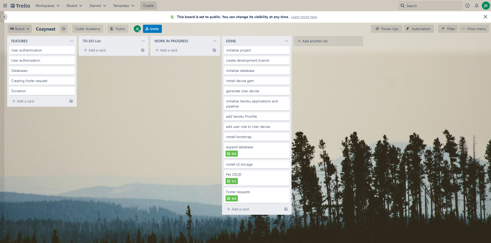

# Cozynest

## Code/Technology Requirements

 

### **R1. Create your app using Ruby on Rails.**

Yes

 

### **R2. Use Postgresql database in development and production.**

Yes

 

### **R3. Your app will have authentication (eg. Devise).**

Yes

 

### **R4. Your app will have authorisation (i.e. users have restrictions on what they can see and edit).**

User role, Shelter and Guardian, has been added as a property (enum)

 

### **R5. Your app will have some type of file (eg. images) uploading capability.**

Will be implementing AWS S3 to store user uploaded images

 

### **R6. Your app is to be deployed to Heroku (recommended) or AWS.**

Deployed via Heroku and AWS for active storage

 

## README document

### **R7. What Problem are you trying to solve by building Cozynest?**

The population of pet owners has increased a lot under the influence of the COVID-19 as lots of people spent their time at home during the lockdown, but there is always been people who abandon their beloved pets. Even if those pets are rescued, the spaces within the organisations are very limited and unfortunately, Euthanasia against those unadopted pets are inevitable in the end.

ASPCA, Ameciran Society for the Prevention of Curelty to Animals, states that they do "recognizes the inevitable necessity for Euthanasia in certian circumstances". Moreover, they "believe that unwanted pets deserve a dignified, painless death rather than suffer from such cruelties as malnutrition, disease of trauma".

 

### **R8. Why is the problem stated above needs to be solved?**

It is convincing that the capacity of the fcaility is very limited but, just like us, humanbeings, animals are also a part of the Earth, a living creature. We do not have a right, authority and privilege to claim their lives.

The idea of Cozynest is to prevent such unwanted happenings as much as possible by connecting the shelters, the organisations, with the individual temporary guardians who could foster the pets before they being adopted to a new family.

 

### **R9. Link to the deployed application**

https://cozynest.herokuapp.com/

 

### **R10. Link to the GitHub repository**

https://github.com/Pogeun/cozynest

 

### **R11. Description of Cozynest:**
#### **Purpose**

Cozynest is designed for two purposes:
1. To free up the spaces within the shelter so that they could admit more animals
2. To secure the time for existing pets to find a new family

 

#### **Functionality / features**

Cozynest has following features:
1. User authentication and authorization
2. Registering the animals to Cozynest's database which will be displayed to the public users
3. Send a foster request which users could leave a comments to appeal their story and background
4. Reviewing foster requests and picking one from potential candidates
5. Terminating a fostering process
6. Creating a review about the animal that users have fostered
7. Donation system

 

#### **Sitemap**

Sitemap

 

#### **Screenshots**

index

 

about

 

contact

 

registration (signup)

 

registration (edit)

 

pets

 

pet (shelter)

 

pet (guardian)

 

foster request

 

foster requests per pet

 

donation

 

#### **Target audience**

The major target audiences are:
1. Shelter (The organisation)
2. Guardian (The fosterer)
3. People who are willing to adopt a pet

 

#### **Tech stack (e.g. html, css, deployment platform, etc)**

<b>Language:</b>
- Ruby
- HTML
- CSS (SCSS)
- JavaScript

<b>Ruby gems:</b>
- Ruby on Rails
- Devise
- Stripe
- Bootstrap
- mail_form
- aws-sdk-s3

<b>Deployment platform:</b>
- Heroku
- AWS S3

<b>Etc.</b>
- PostgreSQL (Database)
- Mailgun

 

### **R12. User stories**

<b>Shelter</b>
- As a shelter representative, I can register animals to the Cozynest so that those animals could free up the space within the organisation.
- As a shelter representative, I can register animals to the Cozynest so that those animals could be adopted to a new family.
- As a shelter representative, I can review foster request and select potential candidates for our registered animal so they can be fostered.

<b>Guardian</b>
- As a guardian, I can submit foster request so that they could foster an animal whilst the shelter representatives find a new family.
- As a guardian, I can terminate the fostering so that they could return the animal to the shelter.
- As a guardian, I can leave a review regarding the pet so that they could leave a positive comments on pet for future references.

<b>Potential adopter</b>
- As a potential adopter, I can take a look on Cozynest so that I could adopt a pet.

 

### **R13. Wireframe**

 

 

 

Index

 

 

 

 

Registration

Generic design is shared for all registration pages like edit account, reset password and sign in.

 

 

 

 

Pets

Generic design is shared for pets index page and user specific pets page.

 

 

 

 

Pet (shelter)

Review foster request and Delete buttons are removed once the pet is fostered.

 

 

 

 

Pet (Guardian)

Foster request button is removed once the pet is fostered and replaced to End fostering button if the guardian is the current user.

 

 

 

 

Fostering

 

 

 

 

Foster requests

 

 

 

 

Foster request details

 

 

 

 

Donation

 

 

 

 

About

 

 

 

 

Contact

 

### **R14. Entity Relationship Diagram**

Entity Relationship Diagram (ERD)

 

### **R15. Explain the different high-level components (abstractions) in your app**

- **User (signup, signin, edit and delete)**

Each potential users can signup, signin, edit and delete their account. During the registration, the users can choose their user type, either Shelter and Guardian. This type cannot be updated and thus if the one wants to create Guardian account alongside Shelter account, they will have to create another account with new authentication details.

- **Pet (register & edit pet, show all existing pets and show details of specific pet)**

Only shelter users can register the new pet or edit their exiting pets' details. However, viewing the pet details as well as viewing the entire lists of existing pets do not require user to be signed in.

Please refer to Foster requests section for the further details.

- **Foster requests (submit new foster request, review existing foster requests, approve the foster request and terminating the **foster)

Only guardian users can submit a foster request regarding the pet. If the pet is not yet fostered, every single guardian users can submit a single request per pet which cannot be edited. This will then be reviewed by the shelter users where he/she can approve one's foster request.

Once the guardian has been chosen, the shelter users cannot delete the pet from the database while the guardian users can no longer submit a foster requests.

If the current user is the guardian of the pet, they can submit a foster termination. Once the process has been terminated and the pet is still on database, meaning that the pet is not yet adopted, the guardian users can submit foster requests again.

- **Leaving the comment of the pet when terminating the foster**

When the guardian users submit the foster termination request, they can leave a comment regarding the pet.

- **Submitting a contact form**

Any users can submit an inquiry to Cozynest with their name, email and comment.

- **Donation**

Any users can donate to Cozynest between 5, 10, 15 and 20 Australian dollars.

 

### **R16. Detail any third party services that your app will use**

- **Heroku**

Heroku is utilized to deploy the application for both staging and production application. Each application has two addons PostgreSQL and Mailgun where PostgreSQL is a free and open-source relational database management system emphasizing extensibility and SQL compliance.

- **AWS S3 & IAM**

AWS, Amazon Web Services, is utilized to be an active storage of the application which is used to store user uploaded pet image files.

- **Mailgun**

As it was stated above, each application has a Mailgun addon added to manage contact form and handle any user submitted contact which will be re-directed to registered email.

 

### **R17. Describe your projects models in terms of the relationships (active record associations) they have with each other**

- **Shelters (Users) - Pets**

Shelters can have zero to many Pets.
 
Pets can only belong to one Shelter.

- **Guardians (Users) - Pets**

Guardians can have zero to many Pets.
 
Pets can only belong to one Guardian.

- **Guardians (Users) - Foster_Requests**

Guardians can have zero to many Foster_Requests.
 
Foster_Requests can only belong to one Guardian.

- **Pets - Foster_Requests**

Pets can have zero to many Foster_Requests.
 
Foster_Requests can only belong to one Pet.

- **Pet_Categories - Pets**

Pet_Categories can have zero to many Pets.
 
Pets can only belong to one Pet_Category.

- **Pets - Pictures (Active_Storages)**

Pets can have zero to one Picture.
 
Pictures can only belong to one Pet.

- **Pets - Reviews**

Pets can have zero to many Reviews.
 
Reviews can only belong to one Pet.

- **Reviews - Reviewers (Users)**

Reviews can only have one Reviewer.
 
Reviewers can belong to zero to many Reviews. 

 

### **R18. Discuss the database relations to be implemented in your application**

- **Users**

id: integer
 
email: string
 
type: string
 
username: string
 
password: string

- **Shelters (single table inheritance from Users table)**

pets: references

- **Guardians (single table inheritance from Users table)**

pets: references

- **Pet_Categories**

id: integer
 
name: string

- **Pets**

id: integer
 
name: string
 
category_id: references
 
description: text
 
picture_id: references
 
shelter_id: references
 
guardian_id: references

- **Active_Storages**

id: integer
 
picture: attachment

- **Foster_Requests**

id: integer
 
guardian_id: references
 
pet_id: references
 
comment: text
 
status: integer

- **Reviews**

reviewer_id: references
 
comment: text
 
reviewable_id: integer
 
reviewable_type: string

 

### **R19. Provide your database schema design**

Schema Design

 

### **R20. Describe the way tasks are allocated and tracked in your project**

https://trello.com/b/syuHWUKP/cozynest

Trello

 

## Slide deck

### **R21. An outline of the problem you were trying to solve by building this particular marketplace app, and why it’s a problem that needs solving**

### **R22. A walkthrough of your app**

Please refer to the slide deck attached to the assignment submission!